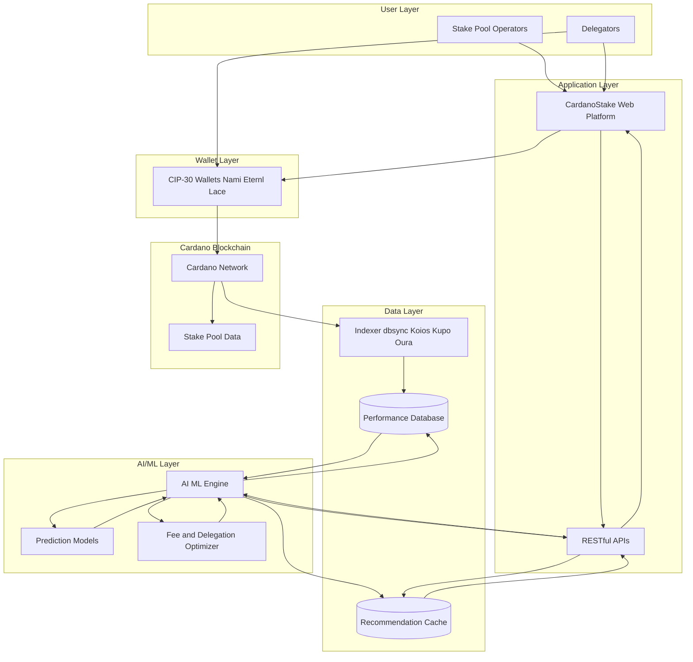

```mermaid
graph TB
    subgraph "User Layer"
        SPO[Stake Pool Operators]
        DEL[Delegators]
    end

    subgraph "Wallet Layer"
        WAL[CIP-30 Wallets Nami Eternl Lace]
    end

    subgraph "Application Layer"
        WEB[CardanoStake Web Platform]
        API[RESTful APIs]
    end

    subgraph "AI/ML Layer"
        AI[AI ML Engine]
        ML[Prediction Models]
        PRED[Fee and Delegation Optimizer]
    end

    subgraph "Data Layer"
        IDX[Indexer dbsync Koios Kupo Oura]
        DB[(Performance Database)]
        CACHE[(Recommendation Cache)]
    end

    subgraph "Cardano Blockchain"
        CARD[Cardano Network]
        POOLS[Stake Pool Data]
    end

    %% User connections
    SPO --> WEB
    DEL --> WEB
    WEB --> WAL
    DEL --> WAL

    %% Application flow
    WEB --> API
    API --> WEB

    %% AI/ML connections
    API --> AI
    AI --> API
    AI --> ML
    ML --> AI
    AI --> PRED
    PRED --> AI

    %% Data connections
    CARD --> IDX
    IDX --> DB
    DB --> AI
    AI --> DB
    AI --> CACHE
    CACHE --> API
    API --> CACHE

    %% Blockchain connections (via wallet)
    WAL --> CARD
    CARD --> POOLS

```
