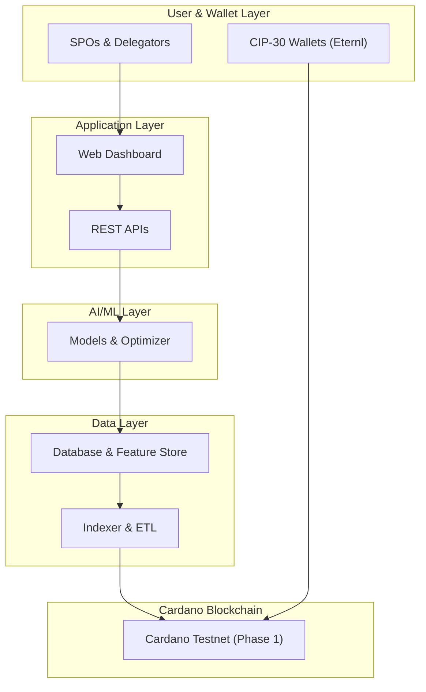
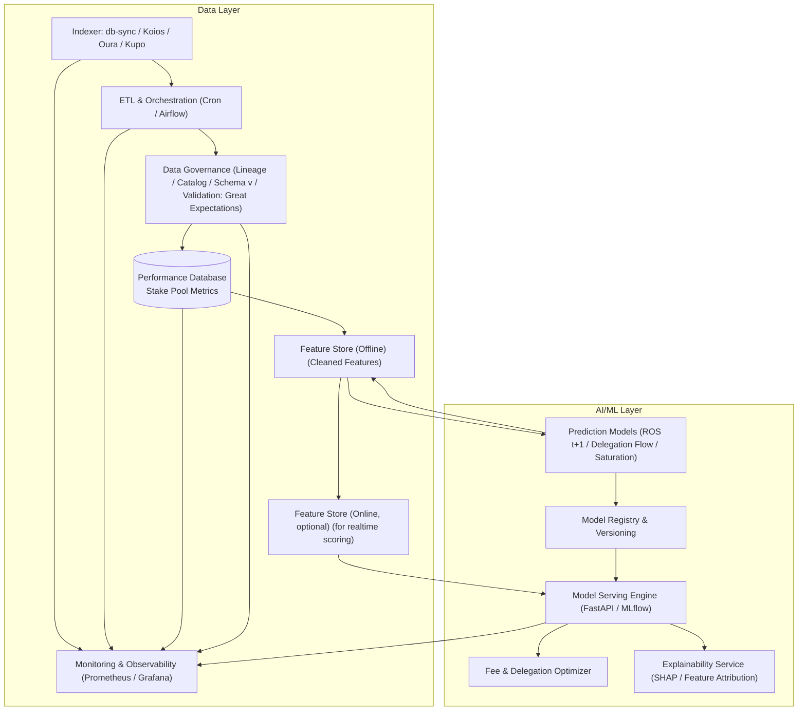
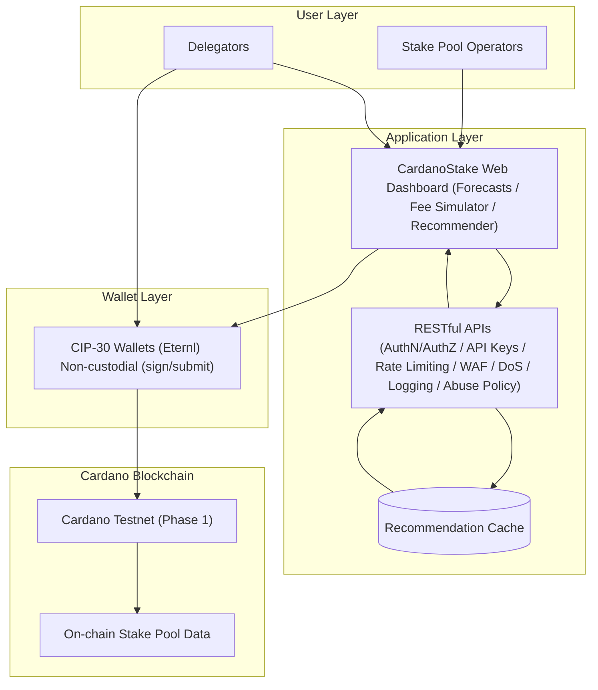

### Overview

```mermaid
graph TB
    subgraph "User & Wallet Layer"
        U1["SPOs & Delegators"]
        U2["CIP-30 Wallets (Eternl)"]
    end

    subgraph "Application Layer"
        A1["Web Dashboard"]
        A2["REST APIs"]
    end

    subgraph "AI/ML Layer"
        M1["Models & Optimizer"]
    end

    subgraph "Data Layer"
        D1["Indexer & ETL"]
        D2["Database & Feature Store"]
    end

    subgraph "Cardano Blockchain"
        BC["Cardano Testnet (Phase 1)"]
    end

    %% Flows
    U1 --> A1
    A1 --> A2
    A2 --> M1
    M1 --> D2
    D2 --> D1
    D1 --> BC
    U2 --> BC

```
---
### Data & AI/ML Layer

```mermaid
graph TB
    subgraph "Data Layer"
        IDX["Indexer: db-sync / Koios / Oura / Kupo"]
        ETL["ETL & Orchestration (Cron / Airflow)"]
        DGOV["Data Governance (Lineage / Catalog / Schema v / Validation: Great Expectations)"]
        DB[("Performance Database\nStake Pool Metrics")]
        FEAT_OFF["Feature Store (Offline) (Cleaned Features)"]
        FEAT_ON["Feature Store (Online, optional) (for realtime scoring)"]
        MON["Monitoring & Observability (Prometheus / Grafana)"]
    end

    subgraph "AI/ML Layer"
        REG["Model Registry & Versioning"]
        ML["Prediction Models (ROS t+1 / Delegation Flow / Saturation)"]
        PRED["Fee & Delegation Optimizer"]
        XPL["Explainability Service (SHAP / Feature Attribution)"]
        SERVE["Model Serving Engine (FastAPI / MLflow)"]
    end

    %% Connections
    IDX --> ETL
    ETL --> DGOV
    DGOV --> DB
    DB --> FEAT_OFF
    FEAT_OFF --> ML
    ML --> FEAT_OFF
    FEAT_OFF --> FEAT_ON
    FEAT_ON --> SERVE
    ML --> REG
    REG --> SERVE
    SERVE --> PRED
    SERVE --> XPL
    %% Monitoring
    IDX --> MON
    ETL --> MON
    DB --> MON
    SERVE --> MON
    DGOV --> MON


```
---
### User, Wallet & Application Layer

```mermaid
graph TB
    subgraph "User Layer"
        SPO[Stake Pool Operators]
        DEL[Delegators]
    end

    subgraph "Wallet Layer"
        WAL["CIP-30 Wallets (Eternl) Non-custodial (sign/submit)"]
    end

    subgraph "Application Layer"
        WEB["CardanoStake Web Dashboard (Forecasts / Fee Simulator / Recommender)"]
        API["RESTful APIs (AuthN/AuthZ / API Keys / Rate Limiting / WAF / DoS / Logging / Abuse Policy)"]
        CACHE[("Recommendation Cache")]
    end

    subgraph "Cardano Blockchain"
        CARD["Cardano Testnet (Phase 1)"]
        POOLS[On-chain Stake Pool Data]
    end

    %% User interactions
    SPO --> WEB
    DEL --> WEB
    WEB --> WAL
    DEL --> WAL

    %% App flow
    WEB --> API
    API --> WEB
    API --> CACHE
    CACHE --> API

    %% Blockchain
    WAL --> CARD
    CARD --> POOLS

```
