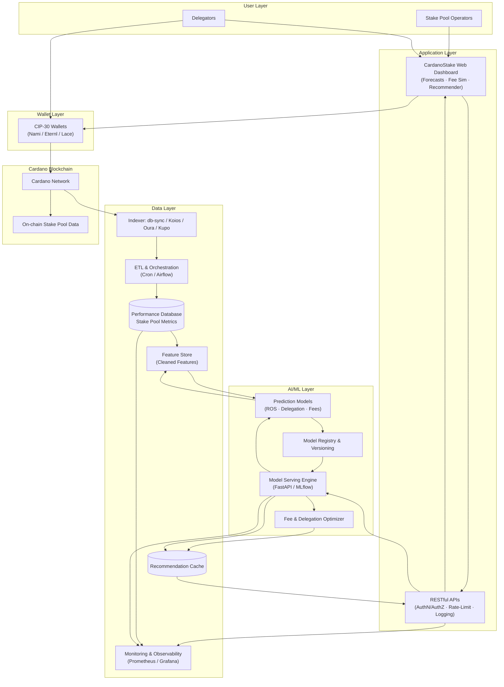

```mermaid
graph TB
    subgraph "User Layer"
        SPO[Stake Pool Operators]
        DEL[Delegators]
    end

    subgraph "Wallet Layer"
        WAL["CIP-30 Wallets\n(Nami / Eternl / Lace)"]
    end

    subgraph "Application Layer"
        WEB["CardanoStake Web Dashboard\n(Forecasts · Fee Sim · Recommender)"]
        API["RESTful APIs\n(AuthN/AuthZ · Rate-Limit · Logging)"]
    end

    subgraph "AI/ML Layer"
        REG["Model Registry & Versioning"]
        ML["Prediction Models\n(ROS · Delegation · Fees)"]
        PRED["Fee & Delegation Optimizer"]
        SERVE["Model Serving Engine\n(FastAPI / MLflow)"]
    end

    subgraph "Data Layer"
        IDX["Indexer: db-sync / Koios / Oura / Kupo"]
        ETL["ETL & Orchestration\n(Cron / Airflow)"]
        DB[("Performance Database\nStake Pool Metrics")]
        FEAT["Feature Store\n(Cleaned Features)"]
        CACHE[("Recommendation Cache")]
        MON["Monitoring & Observability\n(Prometheus / Grafana)"]
    end

    subgraph "Cardano Blockchain"
        CARD[Cardano Network]
        POOLS[On-chain Stake Pool Data]
    end

    %% User connections
    SPO --> WEB
    DEL --> WEB
    WEB --> WAL
    DEL --> WAL

    %% Application flow
    WEB --> API
    API --> WEB

    %% AI/ML connections
    API --> SERVE
    SERVE --> ML
    ML --> REG
    SERVE --> PRED
    PRED --> CACHE
    REG --> SERVE

    %% Data connections
    CARD --> IDX
    IDX --> ETL
    ETL --> DB
    DB --> FEAT
    FEAT --> ML
    ML --> FEAT
    SERVE --> CACHE
    CACHE --> API

    %% Blockchain connections (via wallet)
    WAL --> CARD
    CARD --> POOLS

    %% Monitoring hooks
    API --> MON
    DB --> MON
    SERVE --> MON

```
